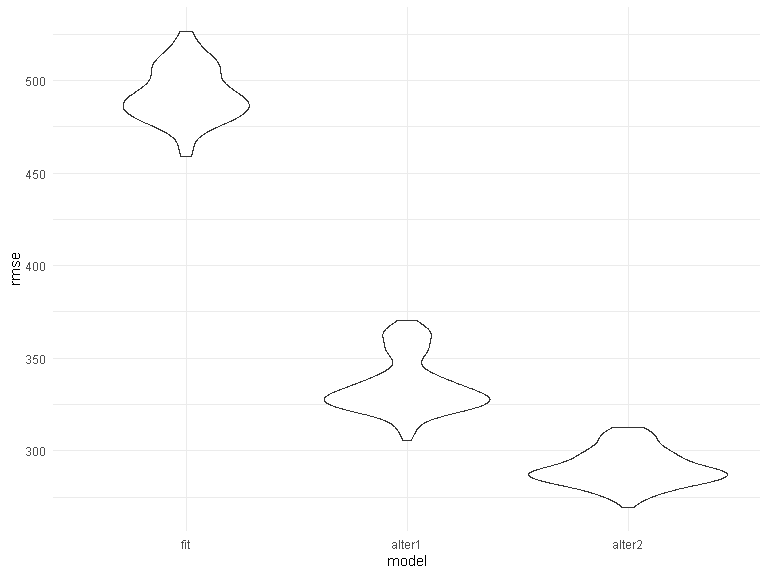
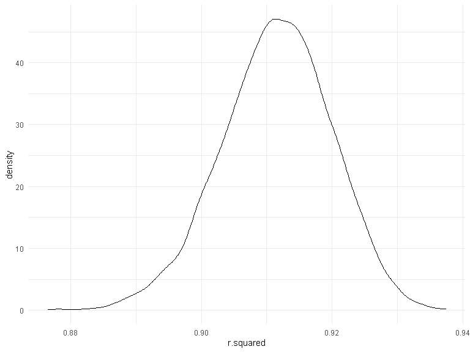
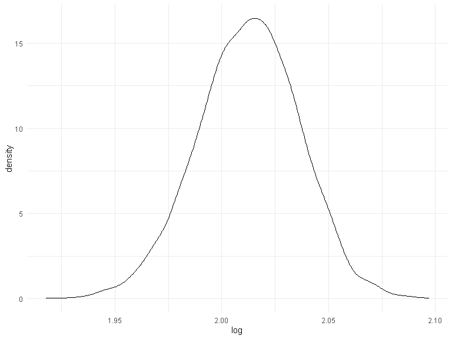

Homework 6 solutions
================
Yali Zhai
2020-12-09

``` r
library(modelr)
library(p8105.datasets)
```

### Problem 1

``` r
homicide_df = 
  read_csv("data/homicide-data.csv", na = c("", "NA", "Unknown")) %>% 
  mutate(
    city_state = str_c(city, state, sep = ", "),
    victim_age = as.numeric(victim_age),
    resolution = case_when(
      disposition == "Closed without arrest" ~ 0,
      disposition == "Open/No arrest"        ~ 0,
      disposition == "Closed by arrest"      ~ 1)
  ) %>% 
  filter(
    victim_race %in% c("White", "Black"),
    city_state != "Tulsa, AL") %>% 
  select(city_state, resolution, victim_age, victim_race, victim_sex)
```

    ## Parsed with column specification:
    ## cols(
    ##   uid = col_character(),
    ##   reported_date = col_double(),
    ##   victim_last = col_character(),
    ##   victim_first = col_character(),
    ##   victim_race = col_character(),
    ##   victim_age = col_double(),
    ##   victim_sex = col_character(),
    ##   city = col_character(),
    ##   state = col_character(),
    ##   lat = col_double(),
    ##   lon = col_double(),
    ##   disposition = col_character()
    ## )

Start with one city.

``` r
baltimore_df =
  homicide_df %>% 
  filter(city_state == "Baltimore, MD")
glm(resolution ~ victim_age + victim_race + victim_sex, 
    data = baltimore_df,
    family = binomial()) %>% 
  broom::tidy() %>% 
  mutate(
    OR = exp(estimate),
    CI_lower = exp(estimate - 1.96 * std.error),
    CI_upper = exp(estimate + 1.96 * std.error)
  ) %>% 
  select(term, OR, starts_with("CI")) %>% 
  knitr::kable(digits = 3)
```

| term              |    OR | CI\_lower | CI\_upper |
| :---------------- | ----: | --------: | --------: |
| (Intercept)       | 1.363 |     0.975 |     1.907 |
| victim\_age       | 0.993 |     0.987 |     1.000 |
| victim\_raceWhite | 2.320 |     1.648 |     3.268 |
| victim\_sexMale   | 0.426 |     0.325 |     0.558 |

Try this across cities.

``` r
models_results_df = 
  homicide_df %>% 
  nest(data = -city_state) %>% 
  mutate(
    models = 
      map(.x = data, ~glm(resolution ~ victim_age + victim_race + victim_sex, data = .x, family = binomial())),
    results = map(models, broom::tidy)
  ) %>% 
  select(city_state, results) %>% 
  unnest(results) %>% 
  mutate(
    OR = exp(estimate),
    CI_lower = exp(estimate - 1.96 * std.error),
    CI_upper = exp(estimate + 1.96 * std.error)
  ) %>% 
  select(city_state, term, OR, starts_with("CI")) 
```

``` r
models_results_df %>% 
  filter(term == "victim_sexMale") %>% 
  mutate(city_state = fct_reorder(city_state, OR)) %>% 
  ggplot(aes(x = city_state, y = OR)) + 
  geom_point() + 
  geom_errorbar(aes(ymin = CI_lower, ymax = CI_upper)) + 
  theme(axis.text.x = element_text(angle = 90, hjust = 1))
```


### Problem 2

Load and clean data.

``` r
baby_df = 
  read_csv("./data/birthweight.csv") %>% 
  mutate(
    babysex = as.factor(babysex),
    frace = as.factor(frace),
    mrace = as.factor(mrace)
  )
```

    ## Parsed with column specification:
    ## cols(
    ##   .default = col_double()
    ## )

    ## See spec(...) for full column specifications.

I guess the mother’s weight at delivery is positively associated with
baby’s birth weight. Fit a simple linear regression.

``` r
model_fit = lm(bwt ~ delwt, data = baby_df)
```

residuals v.s fitted values plot

``` r
baby_df %>% 
  add_predictions(model_fit) %>% 
  add_residuals(model_fit) %>% 
  ggplot(aes(x = pred, y = resid)) + 
  geom_point()
```


cross validation

``` r
cv_df =
  crossv_mc(baby_df, 100) %>% 
  mutate(
    train = map(train, as_tibble),
    test = map(test, as_tibble))
```

``` r
cv_df = 
  cv_df %>% 
  mutate(
    model_fit  = map(train, ~lm(bwt ~ delwt, data = .x)),
    model_alter1 = map(train, ~lm(bwt ~ blength + gaweeks, data = .x)),
    model_alter2  = map(train, ~lm(bwt ~ bhead*blength*babysex, data = .x))) %>%
  mutate(
    rmse_fit = map2_dbl(model_fit, test, ~rmse(model = .x, data = .y)),
    rmse_alter1 = map2_dbl(model_alter1, test, ~rmse(model = .x, data = .y)),
    rmse_alter2 = map2_dbl(model_alter2, test, ~rmse(model = .x, data = .y)))
```

comparison of distribution of rmse

``` r
cv_df %>% 
  select(starts_with("rmse")) %>% 
  pivot_longer(
    everything(),
    names_to = "model", 
    values_to = "rmse",
    names_prefix = "rmse_") %>% 
  mutate(model = fct_inorder(model)) %>% 
  ggplot(aes(x = model, y = rmse)) + geom_violin()
```



### Problem 3

load data.

``` r
weather_df = 
  rnoaa::meteo_pull_monitors(
    c("USW00094728"),
    var = c("PRCP", "TMIN", "TMAX"), 
    date_min = "2017-01-01",
    date_max = "2017-12-31") %>%
  mutate(
    name = recode(id, USW00094728 = "CentralPark_NY"),
    tmin = tmin / 10,
    tmax = tmax / 10) %>%
  select(name, id, everything())
```

    ## Registered S3 method overwritten by 'hoardr':
    ##   method           from
    ##   print.cache_info httr

    ## using cached file: C:\Users\yali\AppData\Local\Cache/R/noaa_ghcnd/USW00094728.dly

    ## date created (size, mb): 2020-12-08 11:49:29 (7.552)

    ## file min/max dates: 1869-01-01 / 2020-12-31

bootstrap

``` r
bootstrap_results =
 weather_df %>% 
  modelr::bootstrap(n = 5000) %>% 
  mutate(
    models = map(strap, ~lm(tmax ~ tmin, data = .x) ),
    summary = map(models, broom::glance),
    results = map(models, broom::tidy)) %>% 
  select(-strap, -models) 
```

distribution of r\_squared

``` r
bootstrap_results %>% 
  unnest(summary) %>% 
   ggplot(aes(x = r.squared)) + geom_density()
```



The distribution of r\_squared is a little negatively skewed.

distribution of log

``` r
log_result = 
 bootstrap_results %>% 
  unnest(results) %>% 
  select(.id, term, estimate) %>% 
  pivot_wider(
    names_from = term,
    values_from = estimate
  ) %>% 
  rename(Intercept = "(Intercept)") %>% 
  mutate(log = log(Intercept*tmin))

log_result %>% 
  ggplot(aes(x = log)) + geom_density()
```



The distribution of log of estimated beta0 \* estimated beta1 looks
normal.

95% confidence interval

``` r
r_squared_CI = 
  bootstrap_results %>% 
  unnest(summary) %>% 
  summarize(
    ci_lower = quantile(r.squared, 0.025), 
    ci_upper = quantile(r.squared, 0.975)) %>% 
  mutate(term = "r_squared")
  
log_CI = 
  log_result %>% 
  summarize(
    ci_lower = quantile(log, 0.025), 
    ci_upper = quantile(log, 0.975)) %>% 
  mutate(term = "log(beta0*beta1)")

rbind(r_squared_CI, log_CI) %>% relocate(term) %>% 
  knitr::kable(digits = 3)
```

| term              | ci\_lower | ci\_upper |
| :---------------- | --------: | --------: |
| r\_squared        |     0.894 |     0.927 |
| log(beta0\*beta1) |     1.965 |     2.059 |
